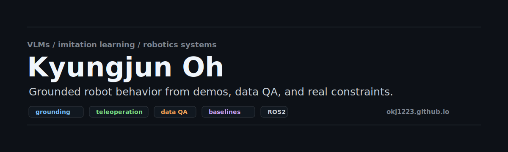
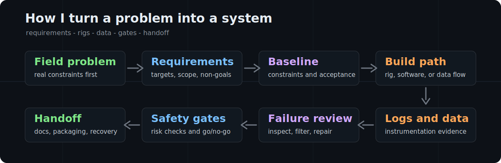

### Kyungjun Oh

I am focused on VLMs, imitation learning, and hardware-aware robotics: the data, grounding, evaluation, and real-world constraints that turn robot demonstrations into deployable behavior.

  
  
  

My strongest work is not one isolated layer. I like the full loop: collect demonstrations, inspect visual grounding failures, build baselines, design evaluation gates, and connect the learned behavior back to real robot constraints.

**At a glance**

| Signal | Evidence |
| --- | --- |
| VLM + imitation-learning interest | Instruction-conditioned manipulation, visual grounding, hallucinated grasp failure, breadcrumb-style supervision |
| Humanoid learning operations | ~10k teleoperation collection attempts, 3-tier QA taxonomy, master-arm + MANUS glove + multi-view data workflows |
| Robot data quality | Clean/dirty/fail labeling, bad-sample filtering, failure review, dataset readiness checks |
| Embodied validation background | ROS2 autonomy, TurtleBot3 digital-twin validation, Pick & Place, perception, inverse kinematics, runtime safety layers |
| Industrial automation foundation | SCR catalyst cleaning, mixing, liquid injection, pump systems, catalyst testbench instrumentation, hazardous-workflow reduction |
| Practical tooling | Ubuntu GUI tools, .deb packaging, local-first workflow kernels, dashboards, audit trails, recovery reports |

**What I am good at**

- Turning messy robot-learning problems into datasets, baselines, metrics, and decision gates.
- Building robotics workflows around VLM-style instruction context, teleoperation, dataset QA, perception, and runtime checks.
- Connecting mechanical design, sensors, control logic, fabrication, and software instead of treating them as separate worlds.
- Making local tools that reduce operational friction: dashboards, CLIs, print pipelines, workflow runners, and personal automation systems.

**System map**

| Layer | What I have built around it |
| --- | --- |
| VLM and imitation learning | Instruction context, visual grounding, target validity, hallucinated grasp metrics, breadcrumb supervision experiments |
| Robot learning data | Teleoperation sessions, glove/finger signals, robot state logs, multi-view vision, bad-sample filtering, failure taxonomies |
| Autonomy and perception | ROS2 nodes, OpenCV/ArUco, YOLO pipelines, sensor fusion, lane following, object detection, safety-event handling |
| Mechanical and fluid systems | Stair-climbing quadruped load cases, pressure vessels, pumps, dry-ice pellet feeding, MFC gas delivery, nozzle/fluid calculations |
| Controls and instrumentation | PID control, inverter control, Arduino/Raspberry Pi orchestration, MQTT, load cells, gas analyzers, temperature zones |
| Operator tools | Local CLIs, dashboards, print/export workflows, install scripts, preview servers, Korean reports, recovery/audit artifacts |

**How I turn a problem into a system**

**Featured systems**

| Work | Signal |
| --- | --- |
| [Humanoid manipulation data workflow](https://okj1223.github.io/projects/robros-humanoid-manipulation-data-pipeline/) | ROBROS research assistant work across master-arm and MANUS glove teleoperation, multi-view data collection, failure review, filtering, and a 3-tier QA taxonomy for warehouse manipulation PoCs. |
| [trace-il-mvp](https://github.com/okj1223/trace-il-mvp) | Toy imitation-learning research MVP for hallucinated grasp reduction using synthetic scenes, behavior cloning baselines, TRACE-style breadcrumbs, diagnostics, and evaluation metrics. |
| [TurtleBot3 autonomous system](https://okj1223.github.io/projects/turtlebot3-autonomous-system/) | ROS2, Gazebo, OpenCV, ArUco, inverse kinematics, sensor fusion, lane following, Pick & Place, and sim-to-real tuning. |
| [SCR catalyst testing apparatus](https://okj1223.github.io/projects/scr-catalyst-testing-apparatus/) | Bench-scale VGB-R 302 style test system with MFC gas delivery, four-zone temperature control, NOx analysis, leak checks, uncertainty, and repeatability thinking. |
| [Robot-based liquid injection](https://okj1223.github.io/projects/liquid_injection/) | ROS2-based precision pouring with a Doosan M0609, load cells, MQTT, adaptive control, flow modeling, and target concentration control within +/-0.5%. |
| [QuadPorter](https://github.com/okj1223/QuadPorter) | Mechanics-first 12-DOF quadruped research workspace for 5 kg payload stair climbing, with load cases, torque envelopes, mass budget, actuator screening, and rig gates. |
| [Notion Printer](https://github.com/okj1223/notion_printer) | Ubuntu GUI/CLI tool that turns messy Notion HTML or ZIP exports into printable integrated documents with pagination, previews, debug factories, and .deb packaging. |
| [Weaveflow](https://github.com/okj1223/weaveflow) | Local-first workflow kernel and OpenClaw/Codex automation experiment focused on task records, recovery, audit trails, Korean reports, and long-running job control. |

<strong>More portfolio systems</strong>

| Project | Why it matters |
| --- | --- |
| [Automated catalyst cleaning robot](https://okj1223.github.io/projects/automated-catalyst-cleaning/) | Arduino control, fluid-delivery nozzles, CAD/CAM, welded frame, motion hardware, and hazardous-environment maintenance automation. |
| [Dry ice blaster feeding system](https://okj1223.github.io/projects/dry-ice-blaster-feeding-system/) | Pressure-vessel design, TIG welding, inverter control, pneumatic transport, two-phase flow, and field equipment manufacturing. |
| [Automated mixing system](https://okj1223.github.io/projects/automated-mixing-system/) | Arduino + Raspberry Pi dual-controller automation with PID control, MQTT, sensor arrays, solenoid valves, and process monitoring. |
| [Dual gear pump system](https://okj1223.github.io/projects/dual-gear-pump-system/) | Hydraulic head analysis, NPSH checks, inverter control, modular frame design, and portable catalyst-regeneration hardware. |
| [PCB inspection system](https://okj1223.github.io/projects/pcb_inspection/) | YOLOv11, ROS2, RealSense, MQTT, voice pipeline, web tooling, custom conveyor, robot handling, and inspection-to-sort flow. |
| [Industrial safety robot system](https://okj1223.github.io/projects/crack-ppe-detection/) | ROS2, YOLOv8, MQTT, Kalman filtering, dashboards, multi-robot coordination, and real-time safety-event awareness. |
| [Alpha Trading Scanner](https://github.com/okj1223/alpha-trading-scanner) | Non-robotics but relevant: guarded automation with arming phrases, kill switch, risk gates, idempotency, broker reconciliation, and audit logs. |

**Tools and materials**

`VLMs` `Imitation Learning` `Robot Data QA` `Python` `PyTorch` `C/C++` `ROS2` `OpenCV` `Gazebo` `Docker` `Linux` `MQTT` `Arduino` `Raspberry Pi` `CAD` `TIG welding`

| Robotics and AI | Industrial systems | Software and ops |
| --- | --- | --- |
| VLMs, imitation learning, ROS2, Gazebo, OpenCV, ArUco, YOLO, dataset QA | CAD/CAM, TIG welding, pumps, pressure vessels, MFCs, PID, inverters, sensors | Python CLIs, Next.js, Supabase, SQLite, Docker, installers, dashboards, local automation |

**Working style**

- I prefer clear baselines over vague ambition.
- I write down assumptions, non-goals, failure cases, and gates before pretending something is finished.
- I care about the handoff: install scripts, local previews, documentation, operating manuals, and recovery paths.
- I am comfortable moving between robot hardware, data workflows, industrial process systems, and practical software tools.

**Current focus**

- Research Assistant at ROBROS, supporting humanoid manipulation data collection and learning workflow operations.
- Currently most interested in VLM-grounded robot behavior, imitation learning, and dataset quality for manipulation.
- Incoming M.S. student in Mechanical Engineering at National Taiwan University.
- Building toward robotics systems that are not just impressive in a demo, but inspectable, repeatable, and field-aware.
