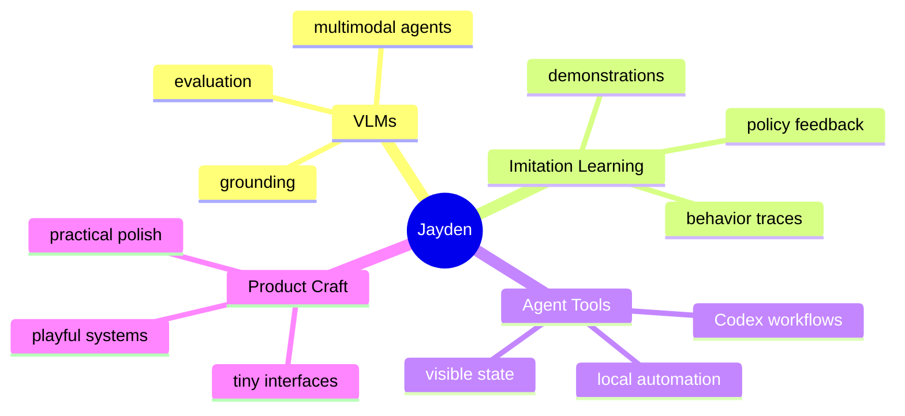

# Jayden

I build small, sharp systems around AI agents, multimodal models, and developer workflows.

Currently spending most of my time around **VLMs**, **imitation learning**, and practical tooling that makes agents easier to understand while they work.

## Current Focus

| Area | What I care about | Signal |
| --- | --- | --- |
| VLMs | visual grounding, multimodal reasoning, evaluation loops | ████████░░ |
| Imitation Learning | demos, policy behavior, feedback traces, evaluation | ███████░░░ |
| Agent Tooling | Codex workflows, local automation, tiny UX details | █████████░ |
| Research Ops | reproducible runs, review artifacts, safety checks | ████████░░ |
| Product Feel | making technical tools feel alive and legible | ███████░░░ |

## Public Work

- [Codex Dot Companion](https://github.com/okj1223/codex-dot-companion)  
  Tiny desktop mascots for Codex sessions. One terminal, one little companion.

- [Portfolio](https://okj1223.github.io/)  
  My personal site.

## Taste

I like tools that are technically useful but still have a little personality. If an agent is working, I want to see it working. If a system has state, I want that state to be visible without opening a dashboard.

## Now

- building around VLM and imitation learning workflows
- experimenting with agent UX and local developer companions
- keeping public repos minimal and intentional
